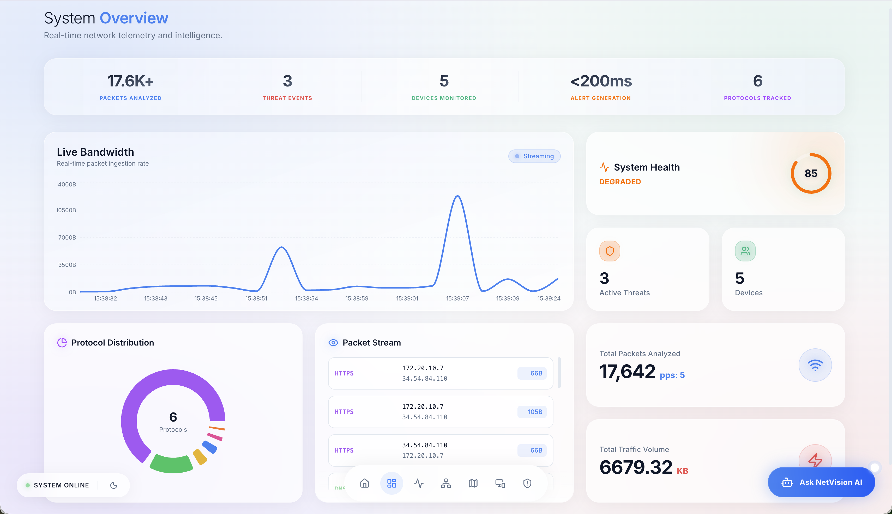
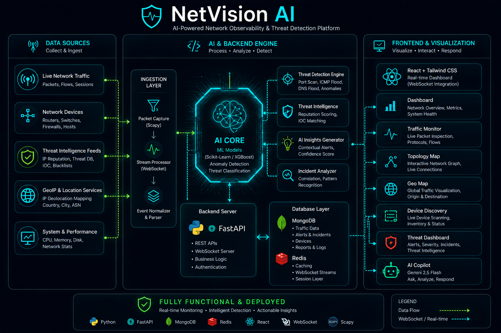
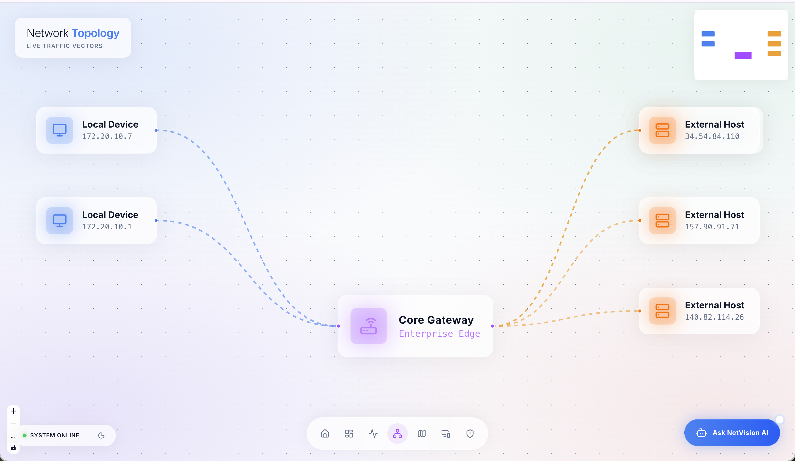
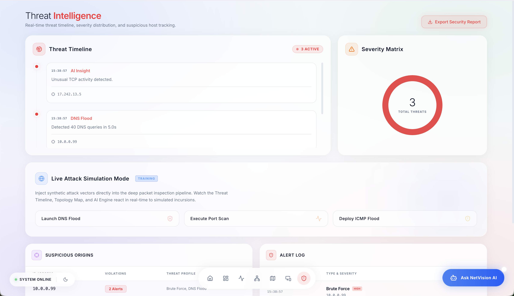
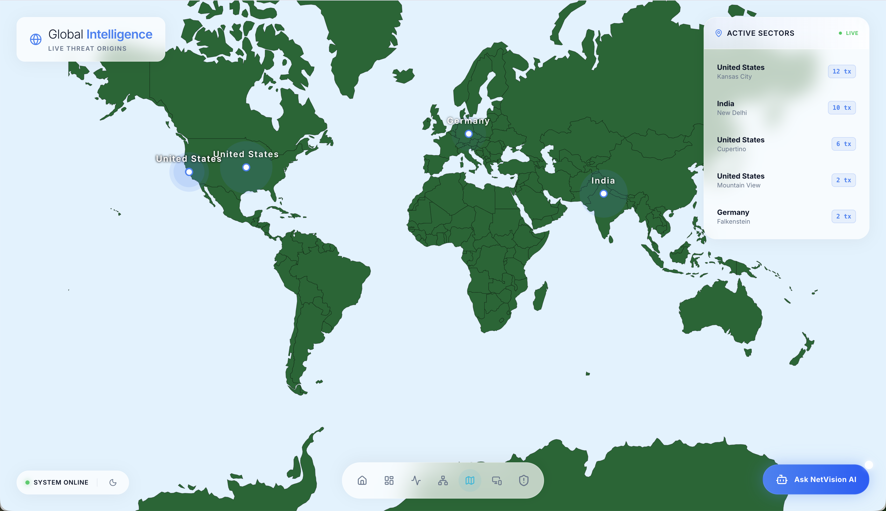
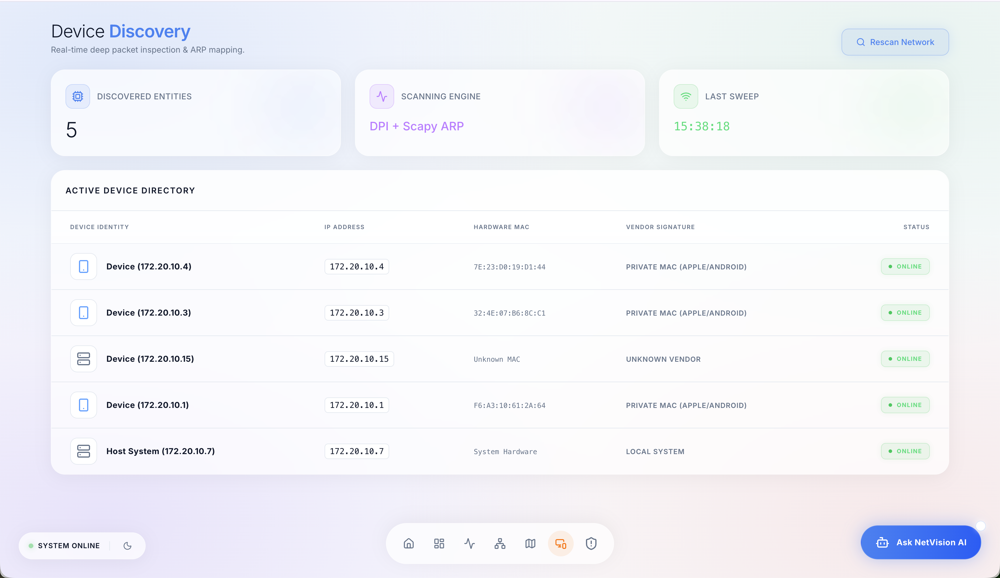

<div align="center">
  

  <h1>NetVision AI</h1>
  <p><strong>Intelligent Network Monitoring & Threat Detection Platform</strong></p>

  <p>
    <a href="https://drive.google.com/file/d/1pWJb7Q1wxUJ1dY_mOEWblPv1iP84Y0iZ/view?usp=sharing"><strong>🎥 Watch Demo Video</strong></a><br/><br/>
    <a href="#features">Features</a> •
    <a href="#tech-stack">Tech Stack</a> •
    <a href="#architecture">Architecture</a> •
    <a href="#installation">Installation</a> •
    <a href="#usage">Usage</a>
  </p>

  <p>
    
    
    
    
  </p>
</div>

<br/>



## 🚀 Overview

**NetVision AI** is a next-generation network observability and security platform. Built with a modern tech stack, it captures real-time network traffic, analyzes protocols, visualizes topology, and detects anomalies using machine learning. 

It serves as a lightweight, intelligent alternative to enterprise solutions, providing deep visibility into your infrastructure, global threat tracking, and automated asset discovery.

---

## ✨ Features

- 📊 **Real-Time Traffic Monitoring**: Live packet capture and deep packet inspection for TCP, UDP, ICMP, DNS, HTTPS, and HTTP.
- 🛡️ **AI-Driven Threat Intelligence**: Automated detection of Port Scans, DDoS attempts, and suspicious IP behaviors.
- 🌐 **Global Intelligence Map**: Geospatial tracking of traffic origins and active threat vectors plotted on a world map.
- 🕸️ **Topology Visualization**: Interactive, auto-generating node map showing relationships between network endpoints.
- 💻 **Automated Device Discovery**: Identifies, profiles, and categorizes connected assets automatically.
- 🤖 **NetVision AI Copilot**: A built-in AI assistant to query network state and summarize threat events.
- 📄 **Automated Reporting**: Export detailed PDF reports of your network health and incidents.

---

## 🛠️ Tech Stack

### Frontend (Client)
- **Framework**: React 18 (Vite)
- **Styling**: Tailwind CSS, Framer Motion (Animations), Custom Glassmorphism UI
- **Data Visualization**: Recharts, React-Simple-Maps, React-Force-Graph
- **Icons**: Lucide React

### Backend (Server & Packet Engine)
- **Framework**: Python (FastAPI)
- **Packet Capture**: Scapy
- **Real-Time Streaming**: Socket.IO / WebSockets
- **Machine Learning**: Scikit-Learn, XGBoost, Pandas, NumPy

---

## 🏗️ Architecture



1. **Packet Sniffer Engine**: Uses Scapy to intercept and decode raw packets at the network interface level.
2. **Analysis Pipeline**: Routes packet metadata through the ML threat detection model.
3. **Socket Stream**: Emits live telemetry, analytics, and alerts via WebSockets to connected clients.
4. **Frontend UI**: Consumes the WebSocket stream to update React state, powering live charts and maps smoothly at 60fps.

---

## 📸 Screenshots

| Topology Mapping | Threat Intelligence |
| :---: | :---: |
|  |  |

| Global Geo-Tracking | Device Discovery |
| :---: | :---: |
|  |  |

---

## ⚙️ Installation

### Prerequisites
- **Python 3.10+**
- **Node.js 18+**
- **Npcap** (Windows) or **libpcap** (Linux/macOS) for packet sniffing.

### 1. Clone the Repository
```bash
git clone https://github.com/abhi-sharma-60/NetVision.git
cd NetVision
```

### 2. Backend Setup
```bash
cd backend
python -m venv venv
source venv/bin/activate  # On Windows: venv\Scripts\activate
pip install -r requirements.txt
```

### 3. Frontend Setup
```bash
cd ../frontend
npm install
```

---

## 🚦 Usage

You will need three terminal windows to run the application.

**Terminal 1: Start the Backend Sniffer**
*(Note: Packet capture requires administrative/root privileges)*
```bash
cd backend
source venv/bin/activate
sudo python3 sniffer.py
```

**Terminal 2: Start the Backend API Server**
```bash
cd backend
source venv/bin/activate
uvicorn main:app --reload --port 8000
```

**Terminal 3: Start the Frontend UI**
```bash
cd frontend
npm run dev
```

Open your browser and navigate to `http://localhost:5173`. 

---

## 🤝 Contributing

Contributions, issues, and feature requests are welcome! Feel free to check the [issues page](https://github.com/abhi-sharma-60/NetVision/issues).

1. Fork the Project
2. Create your Feature Branch (`git checkout -b feature/AmazingFeature`)
3. Commit your Changes (`git commit -m 'Add some AmazingFeature'`)
4. Push to the Branch (`git push origin feature/AmazingFeature`)
5. Open a Pull Request

---

<div align="center">
  <p>Built with ❤️ by <a href="https://github.com/abhi-sharma-60">Abhishek Sharma</a></p>
</div>
